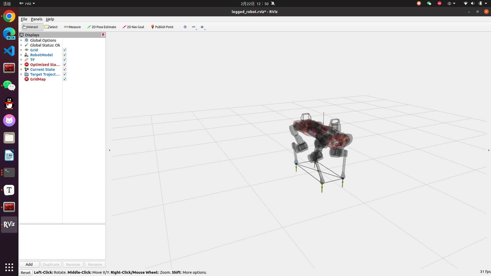
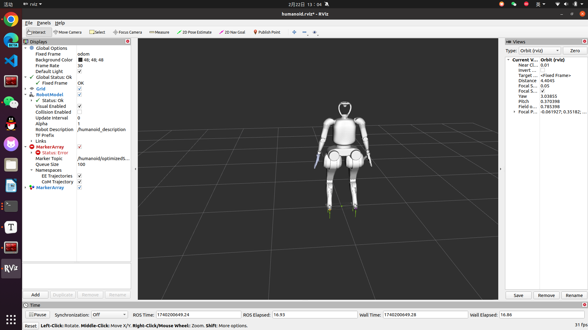

# Kuavo_Selection_Tasks

## 仓库框架

> **video**：演示视频
> **workspace**：两足和四足机器人的工作空间
> **yolo11_train_space**：视觉感知（识别门把手）
>
> ==[如果需要可以使用工具tree生成目录结构](https://blog.csdn.net/SoulmateY/article/details/135281617)==

## 任务完成情况

### 四足机器人

首先根据[项目](https://github.com/pocketxjl/humanoid-control?tab=readme-ov-file)配置好环境，然后执行下面命令运行项目，运行成功截图和视频如下：

```shell
roslaunch ocs2_legged_robot_ros legged_robot_ddp.launch
```



<video width="320" height="240" controls>
    <source src="./video/四足机器人.mp4" type="video/mp4">
</video>
在视频中输入控制指令`1, 1, 0, 90`，其中前三个参数分别表示X，Y和Z，最后一个参数表示角度（单位是degree，**正表示逆时针**，**负表示顺时针**）。所以视频中机器人移动到了`(1, 1)`位置，并且行进过程中**逆时针**转动了`90`度。

+++

### 两足机器人

执行下面命令运行项目，运行成功截图和视频如下：

```shell
roslaunch humanoid_dummy legged_robot_sqp.launch
```



<video width="320" height="240" controls>
    <source src="./video/两足机器人.mp4" type="video/mp4">
</video>

小组实现了一个ROS节点（[代码位于此处](./workspace/src/humanoid-control/humanoid_controllers/src/humanoidTeleop.cpp)），用于**通过键盘控制机器人运动**。该节点通过`ros::Publisher`发布`geometry_msgs::Twist`消息到`/cmd_vel`话题，从而控制机器人在平面上的线速度（前进/后退）和角速度（转向）。用户可以通过键盘上的`WASD`键控制机器人前进、后退、向左转和向右转，其中按住`Shift`键可以使机器人加速移动。每次按键输入都会更新机器人的速度和转向信息，并持续有效，直到下次按键输入改变控制命令。

除此之外，代码还实现了**自动切换步态**的功能，利用`GaitKeyboardPublisher`类。当机器人处于`stance`（站立）姿势时，如果用户按下`WASD`键，机器人将自动切换为`walk`（行走）步态。当机器人线速度和角速度为零时，机器人会自动从`walk`步态切换回`stance`步态，保持静止状态。该设计使得机器人能够根据用户的输入实时调整动作，同时确保切换步态的平滑性和稳定性。

最后将这个ROS节点的启动加入legged_robot_sqp.launch文件，方便**一键启动**。

+++

### 视觉感知

#### 使用YOLOv11模型训练

   - **模型选择**：YOLOv11是YOLO系列的最新版本，具有更高的检测精度和速度。
   - **数据集**：训练模型时使用的数据集是[YOLO_dataset.zip](https://github.com/user-attachments/files/18350937/YOLO_dataset.zip)。

#### YOLO识别到的物体像素坐标发布到ROS话题

   - **模型加载**：将训练好的模型参数`best23.pt`加载到代码中。可以通过修改`YOLO`类的初始化路径来实现。

     ```python
     self.model = YOLO("/path/to/best23.pt")  # 替换为实际的模型路径
     ```

   - **目标检测**：YOLOv11模型会对输入图像进行推理，返回检测到的目标框（`xyxy`格式，即左上角和右下角坐标）。
   - **中心点计算**：
     
     ```python
     self.x = (x1 + x2) / 2
     self.y = (y1 + y2) / 2
     ```
     这里`(x1, y1)`是检测框的左上角坐标，`(x2, y2)`是右下角坐标。
   - **发布到ROS话题**：
     
     - 中心点坐标通过`PointStamped`消息发布到`/yolo/center_coordinates`话题。
     - 检测框坐标通过`Float64MultiArray`消息发布到`/yolo/box_coordinates`话题。
     ```python
     center_msg = PointStamped()
     center_msg.header.stamp = rospy.Time.now()
     center_msg.point.x = self.x
     center_msg.point.y = self.y
     center_msg.point.z = 0  # 2D 图像，z 坐标为 0
     self.center_pub.publish(center_msg)
     
     box_msg = Float64MultiArray()
     box_msg.data = [x1, y1, x2, y2]  # 检测框坐标
     self.box_pub.publish(box_msg)
     ```

#### 卡尔曼滤波
   - **卡尔曼滤波器的作用**：对YOLO检测到的目标中心点坐标进行平滑处理，减少噪声和抖动，特别是在目标移动或检测不稳定的情况下。

   - **实现细节**：
     - 在代码中，卡尔曼滤波器被初始化为一个二维滤波器（`KalmanFilter`），用于跟踪目标的`(x, y)`坐标。
     - 当检测到目标时，使用卡尔曼滤波器的`update`方法更新状态：
       ```python
       (self.xc, self.yc) = self.KF.filter(centers[0])
       ```
     - 当未检测到目标时，使用卡尔曼滤波器的`predict`方法预测目标位置：
       ```python
       self.x, self.y = self.KF.predict()
       ```
     - 最终，滤波后的坐标`(self.xc, self.yc)`用于绘制目标中心点并发布到 ROS 话题。

<video width="320" height="240" controls>
    <source src="./video/视觉感知.mp4" type="video/mp4">
</video>
